# Zimma AI — Tasks Plan

> **Role:** Program Director (Agent 00) · **Status:** AWAITING APPROVAL

---

## Task Dependency Graph

```mermaid
graph TD
    subgraph P0["Phase 0 · Foundations"]
        T01["0.1 Repo layout"]
        T02["0.2 Env + secrets"]
        T03["0.3 Supabase schema"]
        T04["0.4 ADRs"]
    end
    subgraph P1["Phase 1 · Contracts"]
        T11["1.1 API contract"]
        T12["1.2 Data schemas"]
        T13["1.3 ADK I/O freeze"]
    end
    subgraph P2["Phase 2 · ADK Brain"]
        T21["2.1 Intent/NLU"]
        T22["2.2 Maps/Geo client"]
        T23["2.3 Provider Discovery"]
        T24["2.4 Ranking & Decision"]
        T25["2.5 Booking Agent"]
        T26["2.6 Follow-up Agent"]
        T27["2.7 Trace/Observer"]
        T28["2.8 Orchestrator"]
        T29["2.9 Headless ref run"]
    end
    subgraph P3["Phase 3 · Backend"]
        T31["3.1 FastAPI scaffold"]
        T32["3.2 Supabase layer"]
        T33["3.3 POST /requests"]
        T34["3.4 GET endpoints"]
        T35["3.5 SSE trace"]
        T36["3.6 Confirm + booking"]
        T37["3.7 Seed script"]
        T38["3.8 Tests"]
    end
    subgraph P4["Phase 4 · Mobile"]
        T41["4.1 Flutter restructure"]
        T42["4.2 Core layer"]
        T43["4.3 Request screen"]
        T44["4.4 Trace timeline"]
        T45["4.5 Recommendation"]
        T46["4.6 Booking confirm"]
        T47["4.7 Follow-up view"]
        T48["4.8 i18n + RTL"]
    end
    subgraph P5["Phase 5 · Hardening"]
        T51["5.1 Multilingual suite"]
        T52["5.2 Edge cases"]
        T53["5.3 Trace audit"]
        T54["5.4 Compliance check"]
    end
    subgraph P6["Phase 6 · Deliverables"]
        T61["6.1 README"]
        T62["6.2 Architecture map"]
        T63["6.3 Demo script"]
        T64["6.4 Export logs"]
    end

    T01 --> T03
    T02 --> T03
    T03 --> T04
    T04 --> T11
    T11 --> T12
    T12 --> T13
    T13 --> T21
    T13 --> T22
    T13 --> T31
    T21 --> T23
    T22 --> T23
    T23 --> T24
    T24 --> T25
    T25 --> T26
    T26 --> T27
    T27 --> T28
    T28 --> T29
    T31 --> T32
    T32 --> T33
    T33 --> T34
    T34 --> T35
    T35 --> T36
    T36 --> T37
    T37 --> T38
    T29 --> T33
    T38 --> T41
    T41 --> T42
    T42 --> T43
    T43 --> T44
    T44 --> T45
    T45 --> T46
    T46 --> T47
    T47 --> T48
    T48 --> T51
    T51 --> T52
    T52 --> T53
    T53 --> T54
    T54 --> T61
    T61 --> T62
    T62 --> T63
    T63 --> T64
```



---

## Detailed Task List

### Phase 0 — Foundations

#### T-0.1: Repository Layout
- **Owner:** `agents/agents/08-devops-engineer.md`
- **Skill:** —
- **Inputs:** `PROJECT_BRIEF.md` §3 (locked tech decisions)
- **Actions:**
  1. Create `/backend/` directory with `app/` scaffold placeholder
  2. Move current Flutter project into `/mobile/` (or keep at root since Flutter is the root project — **Decision: keep Flutter at repo root** since the existing `pubspec.yaml` is at root; create `/backend/` alongside it)
  3. Create `/infra/`, `/infra/adrs/`, `/deliverables/`
  4. Update `.gitignore` for Python venv, `.env`, `__pycache__`, etc.
- **Output:** Clean repo structure
- **Gate:** `checklists/definition-of-done.md` foundations: repo layout ✓

#### T-0.2: Environment & Secrets
- **Owner:** `agents/agents/08-devops-engineer.md`
- **Inputs:** All API keys needed
- **Actions:**
  1. Create `.env.example` with: `GEMINI_API_KEY`, `GOOGLE_MAPS_API_KEY`, `SUPABASE_URL`, `SUPABASE_ANON_KEY`, `SUPABASE_SERVICE_KEY`
  2. Ensure `.env` in `.gitignore`
  3. Create `backend/app/settings.py` skeleton (pydantic-settings)
- **Output:** `.env.example`, updated `.gitignore`
- **Gate:** No secret in code ✓

#### T-0.3: Supabase Schema Migration
- **Owner:** `agents/agents/02-solution-architect.md` + `agents/agents/03-backend-engineer.md`
- **Skill:** `skills/supabase-data-layer.md`
- **Actions:**
  1. Enable PostGIS extension
  2. Create tables: `users`, `providers`, `provider_availability`, `service_requests`, `bookings`, `follow_ups`, `agent_traces`
  3. Create indexes: GIST on `providers.geo`, B-tree on `providers.category`, composite on `agent_traces(request_id, seq)`
  4. Set up RLS policies
- **Output:** Migration SQL file in `/infra/migrations/`
- **Gate:** All tables exist + PostGIS enabled ✓

#### T-0.4: Architecture Decision Records
- **Owner:** `agents/agents/02-solution-architect.md`
- **Skill:** `templates/adr-template.md`
- **Actions:** Write 4 ADRs:
  1. ADR-001: ADK hub-and-spoke topology
  2. ADR-002: Supabase + PostGIS for geo + realtime + trace
  3. ADR-003: Trace event schema design
  4. ADR-004: SSE vs Supabase Realtime for live trace
- **Output:** 4 ADR files in `/infra/adrs/`
- **Gate:** ADR files exist ✓

---

### Phase 1 — Contracts

#### T-1.1: API Contract
- **Owner:** `agents/agents/02-solution-architect.md`
- **Skill:** `skills/fastapi-service.md`, `templates/api-contract-template.md`
- **Actions:** Document every endpoint with request/response schemas:
  - `POST /api/requests` — create service request
  - `GET /api/requests/{id}` — get status + result
  - `GET /api/requests/{id}/trace` — SSE trace stream
  - `POST /api/requests/{id}/confirm` — confirm recommendation
  - `GET /api/bookings/{id}` — booking details
  - `GET /api/bookings/{id}/receipt` — receipt
- **Output:** `/infra/contracts/api-contract.md`
- **Gate:** Uses template ✓

#### T-1.2: Data Schema Freeze
- **Owner:** `agents/agents/02-solution-architect.md`
- **Actions:** Write Pydantic model definitions:
  - `ServiceIntent`, `ProviderCandidate`, `DiscoveryResult`
  - `RankedProvider`, `RankingResult`
  - `Booking`, `FollowUp`, `TraceEvent`
  - `RequestContext` (ADK session state)
- **Output:** `/backend/app/models.py` (authoritative source)
- **Gate:** Models match all subagent specs ✓

#### T-1.3: ADK I/O Schema Freeze
- **Owner:** `agents/agents/02-solution-architect.md`
- **Actions:** Formalize each sub-agent's input/output as Pydantic:
  - Intent/NLU: `raw_message` → `ServiceIntent`
  - Discovery: `ServiceIntent` → `DiscoveryResult`
  - Ranking: `DiscoveryResult` → `RankingResult`
  - Booking: `RankedProvider + ServiceIntent` → `Booking`
  - Follow-up: `Booking + ServiceIntent` → `list[FollowUp]`
- **Output:** Schemas in `models.py`, cross-referenced with `subagents/`
- **Gate:** Frozen — no change downstream ✓

---

### Phase 2 — Runtime Brain (ADK)

#### T-2.1: Intent / NLU Agent
- **Owner:** `agents/agents/05-ai-agent-engineer.md`
- **Workflow:** `workflows/wf-01-intent-understanding.md`
- **Skill:** `skills/gemini-adk-agent.md`, `skills/roman-urdu-nlu.md`
- **Actions:**
  1. Write system prompt with service taxonomy + time normalization + few-shot examples
  2. Implement as `LlmAgent` with `gemini-2.0-flash`, forced JSON output
  3. Validate against 9 reference phrasings
- **Output:** `backend/app/agents/intent_agent.py`, `backend/app/agents/prompts/intent.txt`
- **Gate:** 9 phrasings pass, ref message → conf ≥ 0.85 ✓

#### T-2.2: Maps / Geo Client
- **Owner:** `agents/agents/06-maps-geo-engineer.md`
- **Skill:** `skills/google-maps-integration.md`
- **Actions:**
  1. Implement `MapsClient`: `geocode()`, `nearby_providers()`, `distance_matrix()`
  2. Implement sector gazetteer (G-10, G-13, F-8, F-10, I-8, I-9, Blue Area, Saddar, etc.)
  3. Implement `find_candidates()` tool: merge Places + PostGIS, dedup, distance-sort
  4. Add degraded mode (Places fails → DB-only + `degraded:true`)
  5. Add thin response cache
- **Output:** `backend/app/services/maps.py`
- **Gate:** G-13 resolves correctly; degraded mode works ✓

#### T-2.3: Provider Discovery Agent
- **Owner:** `agents/agents/05-ai-agent-engineer.md`
- **Workflow:** `workflows/wf-02-provider-discovery.md`
- **Skill:** `skills/gemini-adk-agent.md`
- **Actions:**
  1. Build `LlmAgent` with `find_candidates` as its tool
  2. Radius strategy by urgency (3km/6km/10km)
  3. Empty → double radius → still empty → return empty with reasoning
- **Output:** `backend/app/agents/discovery_agent.py`
- **Gate:** ≥3 candidates for AC technician near G-13 ✓

#### T-2.4: Ranking & Decision Agent
- **Owner:** `agents/agents/05-ai-agent-engineer.md`
- **Workflow:** `workflows/wf-03-matching-ranking.md`
- **Skill:** `skills/gemini-adk-agent.md`
- **Actions:**
  1. Deterministic scoring function (0.40 dist + 0.25 avail + 0.25 rating + 0.10 price)
  2. LLM reasoning that cites actual numbers and contrasts #1 vs #2
  3. Use `gemini-2.x-pro` for reasoning quality
- **Output:** `backend/app/agents/ranking_agent.py`
- **Gate:** Reasoning is specific, numeric, non-generic ✓

#### T-2.5: Booking Agent
- **Owner:** `agents/agents/05-ai-agent-engineer.md`
- **Workflow:** `workflows/wf-04-booking-simulation.md`
- **Skill:** `skills/gemini-adk-agent.md`, `skills/supabase-data-layer.md`
- **Actions:**
  1. Implement `reserve_slot`, `write_booking`, `generate_receipt`, `send_confirmation` tools
  2. Real Supabase INSERT for bookings
  3. Receipt generation, bilingual confirmation
  4. Simulated SMS/WhatsApp with `simulated:true` flag
- **Output:** `backend/app/agents/booking_agent.py`
- **Gate:** Booking row exists; receipt retrievable ✓

#### T-2.6: Follow-up Agent
- **Owner:** `agents/agents/05-ai-agent-engineer.md`
- **Workflow:** `workflows/wf-05-followup-automation.md`
- **Actions:**
  1. Implement `schedule_job`, `update_status`, `confirm_completion` tools
  2. Demo clock compression (configurable)
  3. Write `follow_ups` rows + Supabase Realtime push
- **Output:** `backend/app/agents/followup_agent.py`
- **Gate:** reminder + ≥2 status + completion rows; COMPLETED state ✓

#### T-2.7: Trace / Observer
- **Owner:** `agents/agents/05-ai-agent-engineer.md`
- **Skill:** `skills/agent-trace-logging.md`
- **Actions:**
  1. Implement `before_agent/after_agent/before_tool/after_tool` callbacks
  2. Build `TraceEvent`, INSERT to `agent_traces`
  3. Monotonic `seq` allocation per `request_id`
  4. Stream events (for SSE consumption by backend)
- **Output:** `backend/app/agents/trace_observer.py`
- **Gate:** 5 invariants from `agent-trace-logging.md` ✓

#### T-2.8: Orchestrator Agent (Root)
- **Owner:** `agents/agents/05-ai-agent-engineer.md`
- **Workflow:** All `wf-01..wf-05`
- **Actions:**
  1. State machine driver per `workflow-state-machine.md`
  2. Hub-and-spoke routing — no sub-agent calls another
  3. Error handling: catch → trace → fallback → FAILED
  4. One-line plan narration before each routing decision
- **Output:** `backend/app/agents/orchestrator.py`
- **Gate:** All state transitions fire correctly ✓

#### T-2.9: Headless Reference Run
- **Owner:** `agents/agents/05-ai-agent-engineer.md`
- **Actions:**
  1. Create `backend/scripts/run_reference.py`
  2. Run: `"Mujhe kal subah G-13 mein AC technician chahiye"` end-to-end
  3. Print full ordered trace; assert all transitions
- **Output:** Script + trace output
- **Gate:** Complete linear trace, correct extraction + ranking + booking + follow-up ✓

---

### Phase 3 — Backend Services

#### T-3.1 through T-3.8: (See workplan)
- Sequential: scaffold → Supabase layer → endpoints → seed → tests
- **Critical dependency:** T-2.9 (ADK brain works headless) before T-3.3 (wiring)

---

### Phase 4 — Mobile App

#### T-4.1 through T-4.8: (See workplan)
- Sequential build of 5 screens in priority order
- Wire against contract mock first, switch to real backend

---

### Phase 5 — Hardening

#### T-5.1 through T-5.4: (See workplan)
- QA runs all checklists, files blockers to owners

---

### Phase 6 — Deliverables

#### T-6.1 through T-6.4: (See workplan)
- Tech Writer produces README, architecture map, demo script, exports

---

## Execution Order Summary

```
T-0.1 → T-0.2 → T-0.3 → T-0.4 → [P0 GATE]
→ T-1.1 → T-1.2 → T-1.3 → [P1 GATE]
→ T-2.1 ─┐
  T-2.2 ─┤ (parallel)
          ├→ T-2.3 → T-2.4 → T-2.5 → T-2.6 → T-2.7 → T-2.8 → T-2.9 → [P2 GATE]
→ T-3.1 → T-3.2 → (waits for P2) → T-3.3..T-3.8 → [P3 GATE]
→ T-4.1..T-4.8 → [P4 GATE]
→ T-5.1..T-5.4 → [P5 GATE]
→ T-6.1..T-6.4 → [P6 GATE — DONE]
```

---

> [!IMPORTANT]
> **Awaiting your approval.** Once confirmed, I will begin Phase 0 execution as the DevOps and Solution Architect agents.
