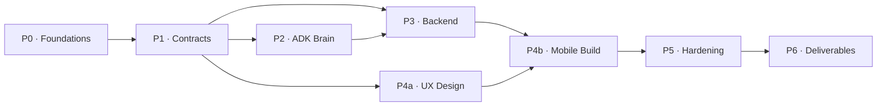

# Zimma AI — Master Workplan

> **Role:** Program Director (Agent 00) · **Source of truth:** `agents/PROJECT_BRIEF.md`
> **Status:** AWAITING APPROVAL — no code written until approved.

---

## Executive Summary

Build **Zimma AI** — an Agentic AI Service Orchestrator for the Informal Economy (Challenge 2, Google Antigravity Hackathon). The system takes a multilingual natural-language request (Urdu / Roman Urdu / English), plans the service lifecycle, discovers real providers via Google Maps + seeded Supabase data, ranks them with transparent reasoning, simulates a booking with visible state change, and automates follow-up — all with a gradable agent trace visible in a Flutter mobile app.

---

## Locked Tech Decisions (immutable)

| Layer | Tech | Notes |
|---|---|---|
| Mobile | **Flutter** (MUST deliverable) | Primary app, mobile-first |
| Backend | **FastAPI** (Python 3.11+) | REST + SSE for live trace |
| AI Orchestration | **Google Gemini ADK** multi-agent | Hub-and-spoke, 6 agents + observer |
| LLM | **Gemini 2.x** | `gemini-2.0-flash` routing, `gemini-2.x-pro` reasoning |
| Geo | **Google Maps Platform** | Places API (New), Distance Matrix, Geocoding, Maps SDK |
| Data / Auth / Realtime | **Supabase** | Postgres + PostGIS + Auth + Realtime |
| Notifications | FCM + simulated SMS/WhatsApp | Simulated = acceptable |

---

## Phase Sequence

> **Parallelization:** After P1, P2 (ADK brain) and P3 (Backend) may run in parallel with P4a (UX design). Mobile build (P4b) starts against contract mocks, switches to real backend when P3 is green.

---

## Phase 0 — Foundations

| # | Task | Owner Agent | Workflow | Skill | Gate |
|---|---|---|---|---|---|
| 0.1 | Create repo layout: `/backend`, `/mobile` (move Flutter to `/mobile`), `/agents` (exists), `/infra`, `/deliverables` | `08-devops-engineer.md` | `wf-build-pipeline.md` | — | `definition-of-done.md#foundations` |
| 0.2 | Create `.env.example` with all keys (Gemini, Maps, Supabase URL/anon/service) + `.gitignore` update | `08-devops-engineer.md` | `wf-build-pipeline.md` | — | No secret in code |
| 0.3 | Supabase project setup + schema migration (PostGIS, all 7 tables) | `02-solution-architect.md` + `03-backend-engineer.md` | `wf-build-pipeline.md` | `supabase-data-layer.md` | Tables exist + PostGIS enabled |
| 0.4 | Write ADRs: (a) ADK hub-and-spoke topology, (b) Supabase + PostGIS, (c) Trace schema, (d) SSE vs Realtime | `02-solution-architect.md` | `wf-build-pipeline.md` | — | ADR files in `/infra/adrs/` |

**Gate:** `checklists/definition-of-done.md` foundations section + ADRs exist.

---

## Phase 1 — Contracts

| # | Task | Owner Agent | Workflow | Skill | Gate |
|---|---|---|---|---|---|
| 1.1 | Author API contract: `POST /requests`, `GET /requests/{id}`, `GET /requests/{id}/trace` (SSE), `POST /requests/{id}/confirm`, booking + follow-up endpoints | `02-solution-architect.md` | `wf-build-pipeline.md` | `fastapi-service.md` | Uses `api-contract-template.md` |
| 1.2 | Freeze data schemas: `ServiceRequest`, `Provider`, `Booking`, `FollowUp`, `TraceEvent`, `ServiceIntent`, `ProviderCandidate`, `RankedProvider` | `02-solution-architect.md` | `wf-build-pipeline.md` | All subagent specs | Pydantic models signed off |
| 1.3 | Freeze ADK agent I/O schemas per `subagents/` — `RequestContext`, per-agent input/output | `02-solution-architect.md` | `wf-build-pipeline.md` | `gemini-adk-agent.md` | Frozen, no change downstream |

**Gate:** Every contract uses the template; Backend (03), AI (05), Mobile (04) sign off.

---

## Phase 2 — Runtime Brain (Gemini ADK Multi-Agent)

| # | Task | Owner Agent | Workflow | Skill | Gate |
|---|---|---|---|---|---|
| 2.1 | Build Intent/NLU Agent — multilingual extraction, confidence scoring, missing-slot detection | `05-ai-agent-engineer.md` | `wf-01-intent-understanding.md` | `gemini-adk-agent.md`, `roman-urdu-nlu.md` | 9 phrasings pass |
| 2.2 | Build Maps/Geo client — `MapsClient`, `resolve_location`, sector gazetteer, `find_candidates` tool | `06-maps-geo-engineer.md` | `wf-02-provider-discovery.md` | `google-maps-integration.md` | G-13 resolves; degraded mode works |
| 2.3 | Build Provider Discovery Agent — calls `find_candidates`, radius strategy, merge/dedup | `05-ai-agent-engineer.md` | `wf-02-provider-discovery.md` | `gemini-adk-agent.md`, `google-maps-integration.md` | ≥3 candidates returned |
| 2.4 | Build Ranking & Decision Agent — deterministic scoring, LLM reasoning, contrast #1 vs #2 | `05-ai-agent-engineer.md` | `wf-03-matching-ranking.md` | `gemini-adk-agent.md` | Reasoning cites actual numbers |
| 2.5 | Build Booking Agent — `reserve_slot`, `write_booking`, `generate_receipt`, `send_confirmation` | `05-ai-agent-engineer.md` | `wf-04-booking-simulation.md` | `gemini-adk-agent.md`, `supabase-data-layer.md` | Booking row exists in Supabase |
| 2.6 | Build Follow-up Agent — schedule jobs, status updates, completion, demo clock | `05-ai-agent-engineer.md` | `wf-05-followup-automation.md` | `gemini-adk-agent.md` | follow_ups rows + COMPLETED |
| 2.7 | Build Trace/Observer — before/after callbacks, structured TraceEvent, Supabase INSERT | `05-ai-agent-engineer.md` | — | `agent-trace-logging.md` | Gap-free seq, no empty reasoning |
| 2.8 | Build Orchestrator Agent — state machine driver, hub-and-spoke routing, error handling | `05-ai-agent-engineer.md` | All `wf-01..wf-05` | `gemini-adk-agent.md` | Full state machine runs headless |
| 2.9 | Headless reference run: `scripts/run_reference.py` — full ordered trace, all transitions | `05-ai-agent-engineer.md` | `wf-build-pipeline.md` | `gemini-adk-agent.md` | Trace is complete + ordered |

**Gate:** `wf-01..wf-05` acceptance all pass; headless trace is complete and ordered.

---

## Phase 3 — Backend Services (FastAPI)

| # | Task | Owner Agent | Workflow | Skill | Gate |
|---|---|---|---|---|---|
| 3.1 | Scaffold FastAPI app per skill layout: `main.py`, `settings.py`, routers, models | `03-backend-engineer.md` | `wf-build-pipeline.md` | `fastapi-service.md` | App starts |
| 3.2 | Implement Supabase access layer (`services/supabase.py`) for all tables | `03-backend-engineer.md` | `wf-build-pipeline.md` | `supabase-data-layer.md` | CRUD operations work |
| 3.3 | Implement `POST /requests` — invoke ADK Orchestrator as background task, return `{request_id, state}` | `03-backend-engineer.md` | `wf-build-pipeline.md` | `fastapi-service.md` | Returns request_id immediately |
| 3.4 | Implement `GET /requests/{id}` — return current state + result | `03-backend-engineer.md` | `wf-build-pipeline.md` | `fastapi-service.md` | Returns structured result |
| 3.5 | Implement `GET /requests/{id}/trace` — SSE stream from `agent_traces` | `03-backend-engineer.md` | `wf-build-pipeline.md` | `fastapi-service.md`, `agent-trace-logging.md` | Events stream in order |
| 3.6 | Implement `POST /requests/{id}/confirm` + booking/follow-up endpoints | `03-backend-engineer.md` | `wf-build-pipeline.md` | `fastapi-service.md` | Contract-compliant |
| 3.7 | Seed script: 80–120 synthetic providers across Islamabad sectors | `03-backend-engineer.md` | `wf-build-pipeline.md` | `supabase-data-layer.md` | Providers visible in DB |
| 3.8 | Contract + integration tests; reference scenario over HTTP | `03-backend-engineer.md` | `wf-build-pipeline.md` | `fastapi-service.md` | All green |

**Gate:** Contract tests green; reference scenario works via HTTP end-to-end.

---

## Phase 4 — Mobile App (Flutter)

| # | Task | Owner Agent | Workflow | Skill | Gate |
|---|---|---|---|---|---|
| 4.1 | Restructure Flutter to `/mobile`, add dependencies (Riverpod, Dio, google_maps_flutter, speech_to_text, l10n) | `04-mobile-engineer.md` | `wf-build-pipeline.md` | `flutter-feature.md` | `flutter run` succeeds |
| 4.2 | Core: API client (Dio), theme, env config, l10n setup (en, ur ARB) | `04-mobile-engineer.md` | `wf-build-pipeline.md` | `flutter-feature.md` | API client callable |
| 4.3 | Screen 1: Request — text field + mic, language chips, example messages | `04-mobile-engineer.md` | `wf-build-pipeline.md` | `flutter-feature.md` | Input sends to API |
| 4.4 | Screen 2: Live Agent Trace Timeline — SSE/Realtime subscription, animated trace cards | `04-mobile-engineer.md` | `wf-build-pipeline.md` | `flutter-feature.md` | Trace streams live |
| 4.5 | Screen 3: Recommendation — provider card, distance, rating, "why this one", map with pins | `04-mobile-engineer.md` | `wf-build-pipeline.md` | `flutter-feature.md`, `google-maps-integration.md` | Map shows pins |
| 4.6 | Screen 4: Booking Confirmation + Receipt — clear before→after state change | `04-mobile-engineer.md` | `wf-build-pipeline.md` | `flutter-feature.md` | Booking confirmed visible |
| 4.7 | Screen 5: Follow-up — live status progression, completion, rating | `04-mobile-engineer.md` | `wf-build-pipeline.md` | `flutter-feature.md` | Status updates live |
| 4.8 | Urdu RTL, localization testing, wire to real backend | `04-mobile-engineer.md` | `wf-build-pipeline.md` | `flutter-feature.md` | No clipped text, RTL correct |

**Gate:** `checklists/demo-readiness-checklist.md` mobile section on a real/emulated device.

---

## Phase 5 — Hardening (QA)

| # | Task | Owner Agent | Workflow | Skill | Gate |
|---|---|---|---|---|---|
| 5.1 | Build test suite: 9 reference phrasings (3× Urdu, 3× Roman Urdu, 3× English) | `07-qa-engineer.md` | `wf-build-pipeline.md` | `roman-urdu-nlu.md` | All extract correctly |
| 5.2 | Edge cases: ambiguous intent, no provider, mixed-language, offline, vague service | `07-qa-engineer.md` | `wf-build-pipeline.md` | — | Graceful handling |
| 5.3 | Trace audit: every transition has event, no empty reasoning, seq gap-free | `07-qa-engineer.md` | `wf-build-pipeline.md` | `agent-trace-logging.md` | Invariants hold |
| 5.4 | Challenge-2 compliance checklist run — line by line | `07-qa-engineer.md` | `wf-build-pipeline.md` | — | `challenge2-compliance-checklist.md` green |

**Gate:** `checklists/challenge2-compliance-checklist.md` fully green.

---

## Phase 6 — Deliverables

| # | Task | Owner Agent | Workflow | Skill | Gate |
|---|---|---|---|---|---|
| 6.1 | README: architecture, APIs, how Antigravity is used, assumptions/limitations, run steps | `10-tech-writer.md` | `wf-build-pipeline.md` | — | README complete |
| 6.2 | Architecture map (Mermaid diagram) | `10-tech-writer.md` + `02-solution-architect.md` | `wf-build-pipeline.md` | — | Diagram accurate |
| 6.3 | Demo video script (3–5 min) hitting all rubric beats | `10-tech-writer.md` | `wf-build-pipeline.md` | — | Script covers 6 beats |
| 6.4 | Export Antigravity Workplan, Tasks Plan, agent_traces to `/deliverables` | `10-tech-writer.md` + `08-devops-engineer.md` | `wf-build-pipeline.md` | `agent-trace-logging.md` | Files present |

**Gate:** All four deliverables present; Program Director sign-off.

---

## Rubric Alignment

| Rubric Area | Weight | Primary Coverage |
|---|---|---|
| **Google Antigravity usage** | 25% | Trace/Observer (P2.7), live trace timeline (P4.4), exported logs (P6.4), this Workplan |
| **Agentic reasoning quality** | 20% | Ranking reasoning (P2.4), Intent extraction (P2.1), hub-and-spoke (P2.8) |
| **Matching quality** | 20% | Deterministic scoring (P2.4), Places + PostGIS merge (P2.2–2.3) |
| **Action simulation** | 15% | Booking agent (P2.5), Supabase state change (P3.3), receipt (P2.5) |
| **Technical implementation** | 10% | FastAPI (P3), Flutter (P4), ADK (P2), Maps (P2.2) |
| **User experience** | 10% | Mobile app (P4), multilingual (P2.1, P4.8), RTL (P4.8) |

---

## Risk & Blockers

| Risk | Mitigation |
|---|---|
| Google Maps API quota during demo | Sector gazetteer fallback + response cache → `degraded:true` |
| Gemini ADK rate limits | Use `gemini-2.0-flash` for routing (cheaper); centralize model config |
| Supabase free tier limits | Minimal schema; RLS for security; connection pooling |
| Flutter + Maps SDK lag | Pre-load map, limit pin count to top 5 |

---

> [!IMPORTANT]
> **This plan requires your approval before any code is written.** Please review and confirm, or provide corrections.
